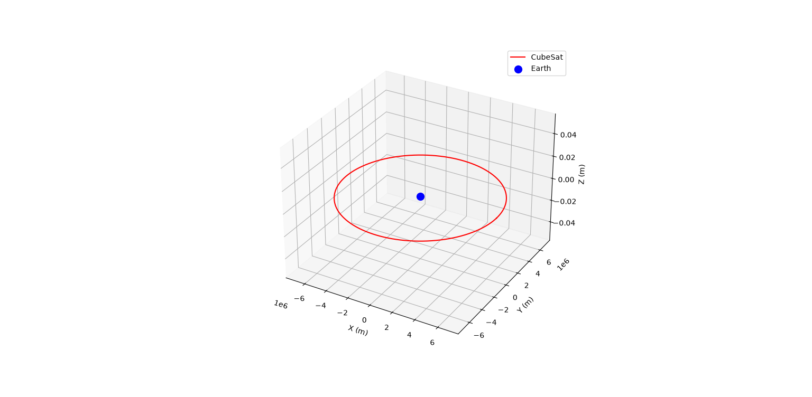
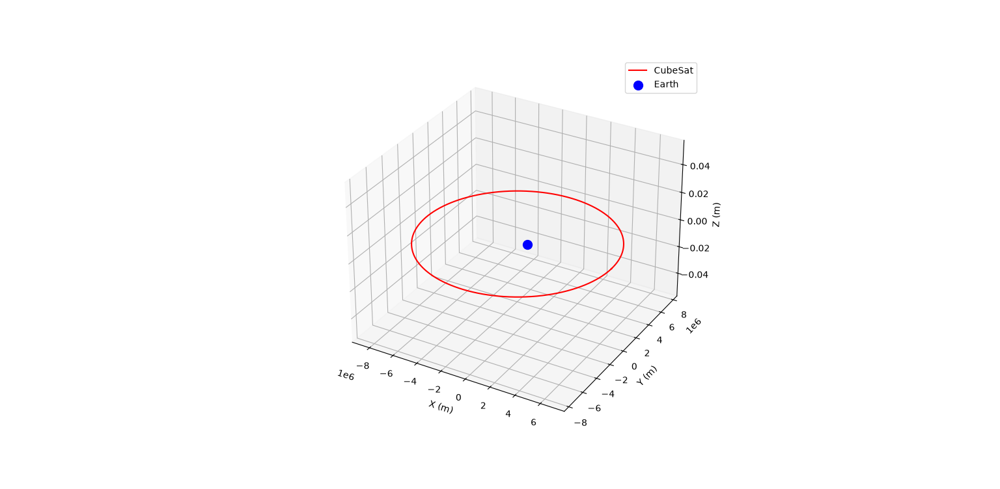

# CubeSat Orbit Simulator

A simple 3D orbital mechanics simulator I wrote for the PoliSpace 6S-CubeSat project application.

## Implementation details

The project is split into two parts: a C backend for the physics engine and a Python script for the visualization.

For the physics engine, I calculated the orbital state vectors over time using Newton's law of universal gravitation. I decided to implement the semi-implicit Euler-Cromer method for numerical integration instead of a standard Euler. This was a necessary choice because Euler-Cromer conserves orbital energy much better, keeping the circular orbit stable without spiraling out over time. The C code then exports the computed trajectory to a .csv file.

To visualize the results, I wrote a quick Python script. It uses Pandas to read the csv data to plot the 3D trajectory of the CubeSat around Earth.

## Elliptical Orbit Test
I also wanted to see how the physics engine handles non-circular trajectories, so I added a second version of the code. 

Instead of using a constant radius, I set a 400 km perigee and a 2000 km apogee. The main physics changes in the C code were replacing the standard circular velocity with the Vis-viva equation to find the exact injection speed at perigee, and adding Kepler's Third Law to automatically compute the exact orbital period for the while loop. 

